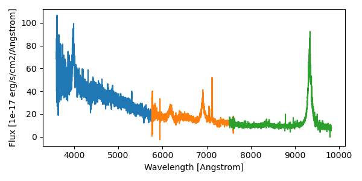

========================================
spectra-SPECTROGRAPH-TILEID-GROUPID.fits
========================================

:Summary: Collection of non-coadded spectra across exposures and cameras
    for a given TILEID on a given SPECTROGRAPH [0-9].
:Naming Convention: ``spectra-SPECTROGRAPH-TILEID-GROUPID.fits``, where
    ``SPECTROGRAPH`` is the spectrograph ID (0-9),
    ``TILEID`` is the tile number and
    ``GROUPID`` depends on the ``GROUPTYPE`` of the tile coadd.
:Regex: ``spectra-[0-9]-[0-9]+-([14]xsubset[1-6]|lowspeedsubset[1-6]|exp[0-9]{8}|thru[0-9]{8}|[0-9]{8})\.fits``
:File Type: FITS, 198 MB

Spectra files contain non-coadded spectra for multiple targets observed on
multiple individual exposures and cameras.  The format can contain any
arbitrary set of targets, though the standard DESI spectroscopic pipeline
outputs are grouped either by a single petal of a given tile,
or all targets on a single healpix.

Tile-based spectra can be grouped in multiple ways across
exposures and nights;  see the top-level :doc:`SPECPROD/tiles/ <../../../index>`
description for an overview of the per-tile GROUPTYPE and GROUPID options.
Healpix-based spectra are grouped by SURVEY and PROGRAM.
Science analyses may release spectra in other groups, e.g. all the spectra
selected for a particular analysis.

See :doc:`coadd files <coadd-SPECTROGRAPH-TILEID-GROUPID>` for a coadded
version of the same spectra in a very similar format.

The FIBERMAP table contains metadata about each target, with one row per
target per exposure.  The corresponding SCORES table contains quantities
measured from the spectra, also with one row per target per exposure.

The spectra themselves are in a set of image HDUs for the FLUX,
IVAR (inverse variance), MASK, and spectral RESOLUTION, each prefixed
with a spectrograph camera name, e.g. B, R, or Z for DESI, though the format
in general could support other numbers and names of cameras for other
instruments.  A row of each image HDU correponds to the target from the
same row index of the FIBERMAP and SCORES HDUs.

Details are given below, with examples for reading and interpreting the
spectra files at the end.

Note: the above is the order in which these HDUs appear in DESI spectroscopic
pipeline output, but the order is arbitrary and they should be read by
name not by number.

Contents
========

====== ============ ======== ===================
Number EXTNAME      Type     Contents
====== ============ ======== ===================
HDU00_              IMAGE    Keywords only
HDU01_ FIBERMAP     BINTABLE Target photometry, metadata, and what fibers they are assigned to
HDU02_ SCORES       BINTABLE QA metrics calculated from the data
HDU03_ B_WAVELENGTH IMAGE    Wavelength grid from the B-cameras
HDU04_ B_FLUX       IMAGE    Spectral Flux, 10^{-17} erg/s/cm2/Angstrom
HDU05_ B_IVAR       IMAGE    Inverse variance of B_FLUX
HDU06_ B_MASK       BINTABLE Mask, 0=good
HDU07_ B_RESOLUTION IMAGE    Resolution Matrix diagonals
HDU08_ R_WAVELENGTH IMAGE    Wavelength grid from the R-cameras
HDU09_ R_FLUX       IMAGE    Spectral Flux, 10^{-17} erg/s/cm2/Angstrom
HDU10_ R_IVAR       IMAGE    Inverse variance of R_FLUX
HDU11_ R_MASK       BINTABLE Mask, 0=good
HDU12_ R_RESOLUTION IMAGE    Resolution Matrix diagonals
HDU13_ Z_WAVELENGTH IMAGE    Wavelength grid from the Z-cameras
HDU14_ Z_FLUX       IMAGE    Spectral Flux, 10^{-17} erg/s/cm2/Angstrom
HDU15_ Z_IVAR       IMAGE    Inverse variance of Z_FLUX
HDU16_ Z_MASK       BINTABLE Mask, 0=good
HDU17_ Z_RESOLUTION IMAGE    Resolution Matrix diagonals
====== ============ ======== ===================

FITS Header Units
=================

HDU00
-----

Keywords only

Required Header Keywords
~~~~~~~~~~~~~~~~~~~~~~~~

.. collapse:: Required Header Keywords Table

    .. rst-class:: keywords

    ========== ================ ==== ==============================================
    KEY        Example Value    Type Comment
    ========== ================ ==== ==============================================
    SPGRP      pernight         str  :doc:`GROUPTYPE <../../../index>` how these spectra are grouped
    SPGRPVAL   20201215         int  :doc:`GROUPID <../../../index>` value
    TILEID     80605            int  Integer tile ID
    SPECTRO    6                int  Spectrograph number (same as PETAL)
    PETAL      6                int  Focal plane petal number (same as SPECTRO)
    CHECKSUM   cXXRdWUQcWUQcWUQ str  HDU checksum updated 2021-07-15T00:33:13
    DATASUM    0                str  data unit checksum updated 2021-07-15T00:33:13
    ========== ================ ==== ==============================================

    Depending upon the SPGRP=GROUPTYPE, there may be additional keywords with more
    human-friendly names for the SPGRPVAL, e.g.

    .. rst-class:: keywords

    =============== ==============
    SPGRP=GROUPTYPE Extra keywords
    =============== ==============
    cumulative      NIGHT: all data through this YEARMMDD
    pernight        NIGHT: only data on this YEARMMDD
    perexp          NIGHT, EXPID: only data from this YEARMMDD and exposure ID
    =============== ==============

HDU 0 does not contain any data.

HDU01
-----

EXTNAME = FIBERMAP

Fibermap information combining the targeting photometry and metadata,
fiberassign requested positions, and actual as-observed fiber locations.

Required Header Keywords
~~~~~~~~~~~~~~~~~~~~~~~~

.. collapse:: Required Header Keywords Table

    .. rst-class:: keywords

    ======== ================ ==== ==============================================
    KEY      Example Value    Type Comment
    ======== ================ ==== ==============================================
    NAXIS1   413              int  Width of table in bytes
    NAXIS2   500              int  Number of unique targets (table rows)
    CHECKSUM TcPqUbPoTbPoTbPo str  HDU checksum updated 2021-07-15T00:33:13
    DATASUM  1051947488       str  data unit checksum updated 2021-07-15T00:33:13
    ======== ================ ==== ==============================================

Required Data Table Columns
~~~~~~~~~~~~~~~~~~~~~~~~~~~

See the :doc:`fibermap documentation </DESI_SPECTRO_REDUX/SPECPROD/preproc/NIGHT/EXPID/fibermap-EXPID>` page
for detailed descriptions of the columns.

.. rst-class:: columns

===================== ======= ===== ===========
Name                  Type    Units Description
===================== ======= ===== ===========
TARGETID              int64
PETAL_LOC             int16
DEVICE_LOC            int32
LOCATION              int64
FIBER                 int32
FIBERSTATUS           int32
TARGET_RA             float64
TARGET_DEC            float64
PMRA                  float32
PMDEC                 float32
REF_EPOCH             float32
LAMBDA_REF            float32
FA_TARGET             int64
FA_TYPE               binary
OBJTYPE               char[3]
FIBERASSIGN_X         float32
FIBERASSIGN_Y         float32
PRIORITY              int32
SUBPRIORITY           float64
OBSCONDITIONS         int32
RELEASE               int16
BRICKID               int32
BRICK_OBJID           int32
MORPHTYPE             char[4]
FLUX_G                float32
FLUX_R                float32
FLUX_Z                float32
FLUX_IVAR_G           float32
FLUX_IVAR_R           float32
FLUX_IVAR_Z           float32
MASKBITS              int16
REF_ID                int64
REF_CAT               char[2]
GAIA_PHOT_G_MEAN_MAG  float32
GAIA_PHOT_BP_MEAN_MAG float32
GAIA_PHOT_RP_MEAN_MAG float32
PARALLAX              float32
BRICKNAME             char[8]
EBV                   float32
FLUX_W1               float32
FLUX_W2               float32
FLUX_IVAR_W1          float32
FLUX_IVAR_W2          float32
FIBERFLUX_G           float32
FIBERFLUX_R           float32
FIBERFLUX_Z           float32
FIBERTOTFLUX_G        float32
FIBERTOTFLUX_R        float32
FIBERTOTFLUX_Z        float32
SERSIC                float32
SHAPE_R               float32
SHAPE_E1              float32
SHAPE_E2              float32
PHOTSYS               char[1]
PRIORITY_INIT         int64
NUMOBS_INIT           int64
SV1_DESI_TARGET [1]_  int64
SV1_BGS_TARGET [1]_   int64
SV1_MWS_TARGET [1]_   int64
SV1_SCND_TARGET [1]_  int64
SV3_DESI_TARGET [1]_  int64
SV3_BGS_TARGET [1]_   int64
SV3_MWS_TARGET [1]_   int64
SV3_SCND_TARGET [1]_  int64
DESI_TARGET           int64
BGS_TARGET            int64
MWS_TARGET            int64
SCND_TARGET [1]_      int64
PLATE_RA              float64
PLATE_DEC             float64
NUM_ITER              int64
FIBER_X               float64
FIBER_Y               float64
DELTA_X               float64
DELTA_Y               float64
FIBER_RA              float64
FIBER_DEC             float64
EXPTIME               float64
PSF_TO_FIBER_SPECFLUX float64
NIGHT                 int32
EXPID                 int32
MJD                   float64
TILEID                int32
===================== ======= ===== ===========

.. [1] Optional

HDU02
-----

EXTNAME = SCORES

Scores / metrics measured from the spectra for use in QA and systematics studies.
These are propagated from the input
:doc:`cframe SCORES HDU </DESI_SPECTRO_REDUX/SPECPROD/exposures/NIGHT/EXPID/cframe-CAMERA-EXPID>`;
see that page for details.

Required Header Keywords
~~~~~~~~~~~~~~~~~~~~~~~~

.. collapse:: Required Header Keywords Table

    .. rst-class:: keywords

    ====== ============= ==== =======================
    KEY    Example Value Type Comment
    ====== ============= ==== =======================
    NAXIS1 488           int  width of table in bytes
    NAXIS2 500           int  ``nspec`` number of rows in table
    ====== ============= ==== =======================

Required Data Table Columns
~~~~~~~~~~~~~~~~~~~~~~~~~~~

See the :doc:`cframe SCORES HDU </DESI_SPECTRO_REDUX/SPECPROD/exposures/NIGHT/EXPID/cframe-CAMERA-EXPID>`
documentation for details about the columns.

.. rst-class:: columns

===================== ======= ===== ===================
Name                  Type    Units Description
===================== ======= ===== ===================
TARGETID              int64         Unique target identifer
SUM_RAW_COUNT_B       float64
MEDIAN_RAW_COUNT_B    float64
MEDIAN_RAW_SNR_B      float64
SUM_FFLAT_COUNT_B     float64
MEDIAN_FFLAT_COUNT_B  float64
MEDIAN_FFLAT_SNR_B    float64
SUM_SKYSUB_COUNT_B    float64
MEDIAN_SKYSUB_COUNT_B float64
MEDIAN_SKYSUB_SNR_B   float64
SUM_CALIB_COUNT_B     float64
MEDIAN_CALIB_COUNT_B  float64
MEDIAN_CALIB_SNR_B    float64
TSNR2_GPBDARK_B       float64
TSNR2_ELG_B           float64
TSNR2_GPBBRIGHT_B     float64
TSNR2_LYA_B           float64
TSNR2_BGS_B           float64
TSNR2_GPBBACKUP_B     float64
TSNR2_QSO_B           float64
TSNR2_LRG_B           float64
SUM_RAW_COUNT_R       float64
MEDIAN_RAW_COUNT_R    float64
MEDIAN_RAW_SNR_R      float64
SUM_FFLAT_COUNT_R     float64
MEDIAN_FFLAT_COUNT_R  float64
MEDIAN_FFLAT_SNR_R    float64
SUM_SKYSUB_COUNT_R    float64
MEDIAN_SKYSUB_COUNT_R float64
MEDIAN_SKYSUB_SNR_R   float64
SUM_CALIB_COUNT_R     float64
MEDIAN_CALIB_COUNT_R  float64
MEDIAN_CALIB_SNR_R    float64
TSNR2_GPBDARK_R       float64
TSNR2_ELG_R           float64
TSNR2_GPBBRIGHT_R     float64
TSNR2_LYA_R           float64
TSNR2_BGS_R           float64
TSNR2_GPBBACKUP_R     float64
TSNR2_QSO_R           float64
TSNR2_LRG_R           float64
SUM_RAW_COUNT_Z       float64
MEDIAN_RAW_COUNT_Z    float64
MEDIAN_RAW_SNR_Z      float64
SUM_FFLAT_COUNT_Z     float64
MEDIAN_FFLAT_COUNT_Z  float64
MEDIAN_FFLAT_SNR_Z    float64
SUM_SKYSUB_COUNT_Z    float64
MEDIAN_SKYSUB_COUNT_Z float64
MEDIAN_SKYSUB_SNR_Z   float64
SUM_CALIB_COUNT_Z     float64
MEDIAN_CALIB_COUNT_Z  float64
MEDIAN_CALIB_SNR_Z    float64
TSNR2_GPBDARK_Z       float64
TSNR2_ELG_Z           float64
TSNR2_GPBBRIGHT_Z     float64
TSNR2_LYA_Z           float64
TSNR2_BGS_Z           float64
TSNR2_GPBBACKUP_Z     float64
TSNR2_QSO_Z           float64
TSNR2_LRG_Z           float64
===================== ======= ===== ===================

HDU03
-----

EXTNAME = B_WAVELENGTH

1D array of B-camera wavelengths in Angstrom, in vacuum (not in air),
in the rest frame of the solar system barycenter.

Required Header Keywords
~~~~~~~~~~~~~~~~~~~~~~~~

.. collapse:: Required Header Keywords Table

    .. rst-class:: keywords

    ====== ============= ==== =====================
    KEY    Example Value Type Comment
    ====== ============= ==== =====================
    NAXIS1 2751          int  number of wavelengths
    BUNIT  Angstrom      str
    ====== ============= ==== =====================

Data: FITS image [float64, 2751]

HDU04
-----

EXTNAME = B_FLUX

2D array of calibrated spectral flux of dimension ``[nspec, nwave]``
in units of 1e-17 erg / (s cm2 Angstrom).
``nspec`` is the number of fibers per camera.
``nwave`` in the length of the wavelength array.
The spectra of all fibers share the same wavelength grid, given in HDU B_WAVELENGTH.

Required Header Keywords
~~~~~~~~~~~~~~~~~~~~~~~~

.. collapse:: Required Header Keywords Table

    .. rst-class:: keywords

    ====== ============================ ==== =====================
    KEY    Example Value                Type Comment
    ====== ============================ ==== =====================
    NAXIS1 2751                         int  ``nwave`` number of wavelengths
    NAXIS2 500                          int  ``nspec`` number of spectra
    BUNIT  10**-17 erg/(s cm2 Angstrom) str
    ====== ============================ ==== =====================

Data: FITS image [float32, 2751x500]

HDU05
-----

EXTNAME = B_IVAR

Inverse variance of flux (1/sigma^2) in units of (10^{-17} erg/s/cm2/A)^-2.
Uncertainties comprise statistical uncertainties from the error propagation
of the initial CCD pixel variance, the calibration uncertainties,
plus an additional term on bright sky lines to account for the
imperfect sky subtraction.

Required Header Keywords
~~~~~~~~~~~~~~~~~~~~~~~~

.. collapse:: Required Header Keywords Table

    .. rst-class:: keywords

    ====== ================================= ==== =====================
    KEY    Example Value                     Type Comment
    ====== ================================= ==== =====================
    NAXIS1 2751                              int  ``nwave`` number of wavelengths
    NAXIS2 500                               int  ``nspec`` number of spectra
    BUNIT  10**+34 (s2 cm4 Angstrom2) / erg2 str
    ====== ================================= ==== =====================

Data: FITS image [float32, 2751x500]

HDU06
-----

EXTNAME = B_MASK

Mask of spectral data; 0=good.
See the :doc:`bitmask documentation </bitmasks>` page for the definition of the bits.

Required Header Keywords
~~~~~~~~~~~~~~~~~~~~~~~~

.. collapse:: Required Header Keywords Table

    .. rst-class:: keywords

    ====== ============= ==== ==========================================
    KEY    Example Value Type Comment
    ====== ============= ==== ==========================================
    NAXIS1 2751          int  ``nwave`` number of wavelengths
    NAXIS2 500           int  ``nspec`` number of spectra
    BZERO  2147483648    int  offset data range to that of unsigned long
    BSCALE 1             int  default scaling factor
    ====== ============= ==== ==========================================

Data: FITS image [int32 (compressed), 2751x500]

HDU07
-----

EXTNAME = B_RESOLUTION

Resolution matrix stored as a 3D sparse matrix, modeling the
per-fiber non-Gaussian effective line-spread-function resolution.
See the :doc:`frame RESOLUTION HDU </DESI_SPECTRO_REDUX/SPECPROD/exposures/NIGHT/EXPID/frame-CAMERA-EXPID>`
documentation for details about using this HDU.

Required Header Keywords
~~~~~~~~~~~~~~~~~~~~~~~~

.. collapse:: Required Header Keywords Table

    .. rst-class:: keywords

    ====== ============= ==== =====================
    KEY    Example Value Type Comment
    ====== ============= ==== =====================
    NAXIS1 2751          int  ``nwave`` number of wavelengths
    NAXIS2 11            int  ``ndiag`` number of diagonals
    NAXIS3 500           int  ``nspec`` number of spectra
    ====== ============= ==== =====================

Data: FITS image [float32, 2751x11x500]

HDU08
-----

EXTNAME = R_WAVELENGTH

1D array of R-camera wavelengths in Angstrom, in vacuum (not in air),
in the rest frame of the solar system barycenter.

Required Header Keywords
~~~~~~~~~~~~~~~~~~~~~~~~

.. collapse:: Required Header Keywords Table

    .. rst-class:: keywords

    ====== ============= ==== =====================
    KEY    Example Value Type Comment
    ====== ============= ==== =====================
    NAXIS1 2326          int  number of wavelengths
    BUNIT  Angstrom      str
    ====== ============= ==== =====================

Data: FITS image [float64, 2326]

HDU09
-----

EXTNAME = R_FLUX

2D array of calibrated spectral flux of dimension ``[nspec, nwave]``
in units of 1e-17 erg / (s cm2 Angstrom).
``nspec`` is the number of fibers per camera.
``nwave`` in the length of the wavelength array.
The spectra of all fibers share the same wavelength grid, given in HDU R_WAVELENGTH.

Required Header Keywords
~~~~~~~~~~~~~~~~~~~~~~~~

.. collapse:: Required Header Keywords Table

    .. rst-class:: keywords

    ====== ============================ ==== =====================
    KEY    Example Value                Type Comment
    ====== ============================ ==== =====================
    NAXIS1 2326                         int  ``nwave`` number of wavelengths
    NAXIS2 500                          int  ``nspec`` number of spectra
    BUNIT  10**-17 erg/(s cm2 Angstrom) str
    ====== ============================ ==== =====================

Data: FITS image [float32, 2326x500]

HDU10
-----

EXTNAME = R_IVAR

Inverse variance of flux (1/sigma^2) in units of (10^{-17} erg/s/cm2/A)^-2.
Uncertainties comprise statistical uncertainties from the error propagation
of the initial CCD pixel variance, the calibration uncertainties,
plus an additional term on bright sky lines to account for the
imperfect sky subtraction.

Required Header Keywords
~~~~~~~~~~~~~~~~~~~~~~~~

.. collapse:: Required Header Keywords Table

    .. rst-class:: keywords

    ====== ================================= ==== =====================
    KEY    Example Value                     Type Comment
    ====== ================================= ==== =====================
    NAXIS1 2326                              int  ``nwave`` number of wavelengths
    NAXIS2 500                               int  ``nspec`` number of spectra
    BUNIT  10**+34 (s2 cm4 Angstrom2) / erg2 str
    ====== ================================= ==== =====================

Data: FITS image [float32, 2326x500]

HDU11
-----

EXTNAME = R_MASK

Mask of spectral data; 0=good.
See the :doc:`bitmask documentation </bitmasks>` page for the definition of the bits.

Required Header Keywords
~~~~~~~~~~~~~~~~~~~~~~~~

.. collapse:: Required Header Keywords Table

    .. rst-class:: keywords

    ====== ============= ==== ==========================================
    KEY    Example Value Type Comment
    ====== ============= ==== ==========================================
    NAXIS1 2326          int  ``nwave`` number of wavelengths
    NAXIS2 500           int  ``nspec`` number of spectra
    BZERO  2147483648    int  offset data range to that of unsigned long
    BSCALE 1             int  default scaling factor
    ====== ============= ==== ==========================================

Data: FITS image [int32 (compressed), 2326x500]

HDU12
-----

EXTNAME = R_RESOLUTION

Resolution matrix stored as a 3D sparse matrix, modeling the
per-fiber non-Gaussian effective line-spread-function resolution.
See the :doc:`frame RESOLUTION HDU </DESI_SPECTRO_REDUX/SPECPROD/exposures/NIGHT/EXPID/frame-CAMERA-EXPID>`
documentation for details about using this HDU.

Required Header Keywords
~~~~~~~~~~~~~~~~~~~~~~~~

.. collapse:: Required Header Keywords Table

    .. rst-class:: keywords

    ====== ============= ==== =====================
    KEY    Example Value Type Comment
    ====== ============= ==== =====================
    NAXIS1 2326          int  ``nwave`` number of wavelengths
    NAXIS2 11            int  ``ndiag`` number of diagonals
    NAXIS3 500           int  ``nspec`` number of spectra
    ====== ============= ==== =====================

Data: FITS image [float32, 2326x11x500]

HDU13
-----

EXTNAME = Z_WAVELENGTH

1D array of Z-camera wavelengths in Angstrom, in vacuum (not in air),
in the rest frame of the solar system barycenter.

Required Header Keywords
~~~~~~~~~~~~~~~~~~~~~~~~

.. collapse:: Required Header Keywords Table

    .. rst-class:: keywords

    ====== ============= ==== =====================
    KEY    Example Value Type Comment
    ====== ============= ==== =====================
    NAXIS1 2881          int  ``nwave`` number of wavelengths
    BUNIT  Angstrom      str
    ====== ============= ==== =====================

Data: FITS image [float64, 2881]

HDU14
-----

EXTNAME = Z_FLUX

2D array of calibrated spectral flux of dimension ``[nspec, nwave]``
in units of 1e-17 erg / (s cm2 Angstrom).
``nspec`` is the number of fibers per camera.
``nwave`` in the length of the wavelength array.
The spectra of all fibers share the same wavelength grid, given in HDU Z_WAVELENGTH.

Required Header Keywords
~~~~~~~~~~~~~~~~~~~~~~~~

.. collapse:: Required Header Keywords Table

    .. rst-class:: keywords

    ====== ============================ ==== =====================
    KEY    Example Value                Type Comment
    ====== ============================ ==== =====================
    NAXIS1 2881                         int  ``nwave`` number of wavelengths
    NAXIS2 500                          int  ``nspec`` number of spectra
    BUNIT  10**-17 erg/(s cm2 Angstrom) str
    ====== ============================ ==== =====================

Data: FITS image [float32, 2881x500]

HDU15
-----

EXTNAME = Z_IVAR

Inverse variance of flux (1/sigma^2) in units of (10^{-17} erg/s/cm2/A)^-2.
Uncertainties comprise statistical uncertainties from the error propagation
of the initial CCD pixel variance, the calibration uncertainties,
plus an additional term on bright sky lines to account for the
imperfect sky subtraction.

Required Header Keywords
~~~~~~~~~~~~~~~~~~~~~~~~

.. collapse:: Required Header Keywords Table

    .. rst-class:: keywords

    ====== ================================= ==== =====================
    KEY    Example Value                     Type Comment
    ====== ================================= ==== =====================
    NAXIS1 2881                              int  ``nwave`` number of wavelengths
    NAXIS2 500                               int  ``nspec`` number of spectra
    BUNIT  10**+34 (s2 cm4 Angstrom2) / erg2 str
    ====== ================================= ==== =====================

Data: FITS image [float32, 2881x500]

HDU16
-----

EXTNAME = Z_MASK

Mask of spectral data; 0=good.
See the :doc:`bitmask documentation </bitmasks>` page for the definition of the bits.

Required Header Keywords
~~~~~~~~~~~~~~~~~~~~~~~~

.. collapse:: Required Header Keywords Table

    .. rst-class:: keywords

    ====== ============= ==== ==========================================
    KEY    Example Value Type Comment
    ====== ============= ==== ==========================================
    NAXIS1 2881          int  ``nwave`` number of wavelengths
    NAXIS2 500           int  ``nspec`` number of spectra
    BZERO  2147483648    int  offset data range to that of unsigned long
    BSCALE 1             int  default scaling factor
    ====== ============= ==== ==========================================

Data: FITS image [int32 (compressed), 2881x500]

HDU17
-----

EXTNAME = Z_RESOLUTION

Resolution matrix stored as a 3D sparse matrix, modeling the
per-fiber non-Gaussian effective line-spread-function resolution.
See the :doc:`frame RESOLUTION HDU </DESI_SPECTRO_REDUX/SPECPROD/exposures/NIGHT/EXPID/frame-CAMERA-EXPID>`
documentation for details about using this HDU.

Required Header Keywords
~~~~~~~~~~~~~~~~~~~~~~~~

.. collapse:: Required Header Keywords Table

    .. rst-class:: keywords

    ====== ============= ==== =====================
    KEY    Example Value Type Comment
    ====== ============= ==== =====================
    NAXIS1 2881          int  ``nwave`` number of wavelengths
    NAXIS2 11            int  ``ndiag`` number of diagonals
    NAXIS3 500           int  ``nspec`` number of spectra
    ====== ============= ==== =====================

Data: FITS image [float32, 2881x11x500]

Notes and Examples
==================

Spectra can be read and plotted with Python code like::

    from astropy.io import fits

    wave = dict()
    flux = dict()
    with fits.open('spectra-0-100-thru20210505.fits.gz') as hdus:
        for camera in ['B', 'R', 'Z']:
            wave[camera] = hdus[f'{camera}_WAVELENGTH'].data
            flux[camera] = hdus[f'{camera}_FLUX'].data

    import matplotlib.pyplot as plt
    plt.figure(figsize=(6,3))
    ispec = 217
    for camera in wave.keys():
        plt.plot(wave[camera], flux[camera][ispec])

    plt.xlabel('Wavelength [Angstrom]')
    plt.ylabel('Flux [1e-17 erg/s/cm2/Angstrom]')
    plt.tight_layout()
    plt.show()

The `desispec <https://github.com/desihub/desispec>`_ package provides
utility functions and classes for reading, slicing, combining, and writing
spectra.  e.g. the same plot can be made with::

    from desispec.io import read_spectra
    sp = read_spectra('spectra-0-100-thru20210505.fits.gz')

    import matplotlib.pyplot as plt
    plt.figure(figsize=(6,3))
    ispec = 217
    for camera in sp.bands:
        plt.plot(sp.wave[camera], sp.flux[camera][ispec])

    plt.xlabel('Wavelength [Angstrom]')
    plt.ylabel('Flux [1e-17 erg/s/cm2/Angstrom]')
    plt.tight_layout()
    plt.show()

or multiple spectra files can be read, sub-selected, combined, and re-written with::

    from desispec.io import read_spectra, write_spectra
    from desispec.spectra import stack
    spectra = list()
    for petal in range (10):
        sp = read_spectra(f'spectra-{petal}-100-thru20210505.fits')
        keep = sp.fibermap['FLUX_R'] > 10**((22.5-17)/2.5)   # mag_r > 17
        spectra.append(sp[keep])

    combined_spectra = stack(spectra)
    write_spectra('bright_spectra.fits', combined_spectra)

The format supports arbitrary channel (camera) names as long as for each channel {X}
there is a set of HDUs named {X}_WAVELENGTH, {X}_FLUX, {X}_IVAR, {X}_MASK,
{X}_RESOLUTION.

The contents of the spectra files are a reformatting of the data in multiple
input :doc:`cframe files </DESI_SPECTRO_REDUX/SPECPROD/exposures/NIGHT/EXPID/cframe-CAMERA-EXPID>` files.
Spectra files do not contain any additional information or calculations beyond
what is already in the cframe files, but they provide an analysis convenience
to get all the data for a given tile petal or healpix in a single file without
having to find and read multiple cframe files across multiple nights,
exposures, and cameras.

The FIBERMAP and SCORES tables are concatenated from the input cframe files,
with one row per target per exposure.  The WAVELENGTH, FLUX, IVAR, MASK,
and RESOLUTION HDUs of the input cframes are combined and stored here
with a \[BRZ\]\_ prefix, e.g. B_FLUX for the stack of all FLUX HDUs from
the input B-camera cframes.

